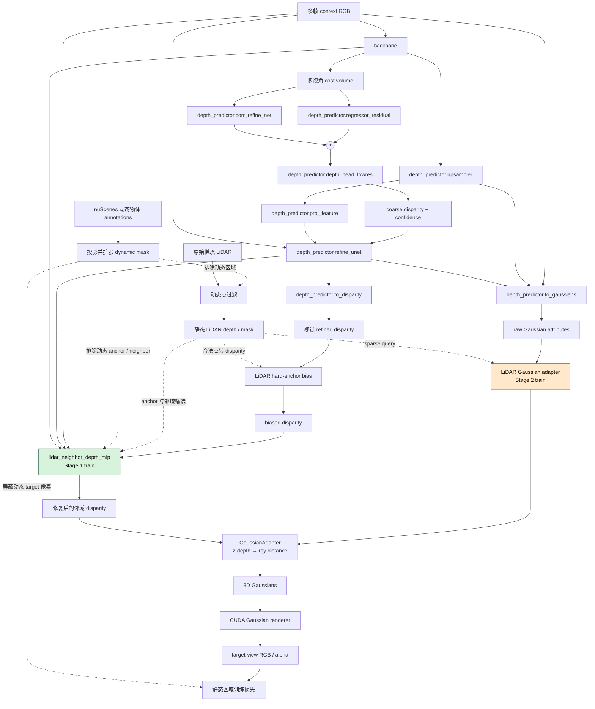

# LiDAR-Enhanced MVSplat

本项目基于 [MVSplat](https://github.com/donydchen/mvsplat) 开发，面向 nuScenes 时序多视角输入，将稀疏 LiDAR 引入 cost-volume 深度预测和 3D Gaussian 属性预测。当前实现的重点已经从单一 LiDAR bias 消融推进到“LiDAR 深度锚点 + 邻域深度传播 + Gaussian 属性修正”的两阶段训练。

## 1. 当前进度

目前仓库包含以下可运行配置：

| 配置 | 作用 | 当前训练目标 |
| --- | --- | --- |
| `stage1.yaml` | LiDAR 邻域深度修复 | 仅训练 `lidar_neighbor_depth_mlp` |
| `stage2.yaml` | LiDAR Gaussian 属性修正 | 冻结 Stage 1，训练 Gaussian adapter |

已经完成的主要改动：

- 新增 nuScenes 时序数据接入，默认使用 `CAM_FRONT`、两个 context 帧和一个 target 帧；
- 新增运动物体 mask：将带动态属性的 nuScenes 3D annotation box 投影到图像，并扩张为保守的二维遮罩；动态区域的 LiDAR 点会在进入模型前被删除，训练损失也只在静态 target 像素上统计；
- 在视觉深度 refinement 之后注入合法 LiDAR disparity，LiDAR 点作为稀疏硬锚点，超出相机 near/far 范围的点会被丢弃；
- 新增 `lidar_neighbor_depth_mlp`，依据参考 disparity、浅层/精炼特征相似度、RGB 差异和空间支持，将锚点修正有界地传播到同表面邻域；
- 新增 LiDAR Gaussian cross-attention adapter，可按配置修正 Gaussian 的 SH DC 与 opacity（当前 Stage 2 默认设置）；
- 新增邻域深度和 Gaussian adapter 的专用训练损失、alpha 改善指标及动态诊断输出；
- Gaussian 中心深度统一由 camera z-depth 转换为沿射线距离，并使用预测的 sub-pixel offset 计算对应射线；
- 增加严格的 `frozen_params` 前缀检查，避免配置写错后意外训练基础网络。

当前阶段仍以 `v1.0-mini`、`176 × 320` 分辨率和 2000 steps 配置进行开发验证；正式结论应在 trainval split、更长训练和统一 checkpoint 条件下复现。

## 2. 模型流程

下图对应当前 `EncoderCostVolume` 与 `DepthPredictorMultiView` 的主数据流。虚线表示 LiDAR 分支；Stage 1 和 Stage 2 的可训练模块分别用绿色和橙色标出。



说明：`to_gaussians` 预测几何/颜色原始参数，`to_disparity` 预测 full-resolution disparity residual 与 density。邻域 MLP 只修改深度；Stage 2 adapter 默认只修改 LiDAR 像素处的 SH DC 和 opacity，不修改 xy、scale、rotation 或其余 SH 系数。RGB 图像本身不会被 dynamic mask 擦除，因此 backbone 和 cost volume 仍能看到完整画面；mask 只约束 LiDAR、邻域传播与损失的有效区域。

## 3. 环境安装

推荐 Linux、Python 3.10 和支持 CUDA 的 NVIDIA GPU：

```bash
conda create -n lidar_mvsplat python=3.10 -y
conda activate lidar_mvsplat

pip install torch==2.1.2 torchvision==0.16.2 torchaudio==2.1.2 \
  --index-url https://download.pytorch.org/whl/cu118
pip install -r requirements.txt
pip install nuscenes-devkit
pip install ./diff-gaussian-rasterization-modified-main
```

检查 CUDA rasterizer：

```bash
python -c "import diff_gaussian_rasterization; print('Rasterizer OK')"
```

如编译失败，请检查 PyTorch CUDA、CUDA Toolkit 和 GCC/G++ 的版本兼容性，以及 `diff-gaussian-rasterization-modified-main/third_party` 是否完整。

## 4. 数据与 checkpoint

将 nuScenes 放置为：

```text
datasets/nuscenes/
├── maps/
├── samples/
├── sweeps/
├── v1.0-mini/
└── v1.0-trainval/
```

默认时序设置为：

```text
context: [t-2, t-1]
target:  [t]
camera:  CAM_FRONT
```

### 4.1 运动物体 mask

数据集根据 nuScenes annotation 的动态 attribute 筛选运动物体，将其世界坐标 3D box 投影到对应相机。投影框会按比例扩张，并保证最小像素 padding，以覆盖标注框边缘和投影误差：

```yaml
dataset:
  dynamic_mask_expansion_ratio: 0.15
  dynamic_mask_min_padding_px: 8
  dynamic_mask_min_depth: 0.01
```

生成的 `context.dynamic_mask` 和 `target.dynamic_mask` 用于：

- 在数据加载阶段删除 context 与 target 动态区域内的 LiDAR depth/mask；
- 禁止动态像素成为 `lidar_neighbor_depth_mlp` 的 LiDAR anchor 或候选 neighbor；
- 从 MSE、邻域深度 loss 和 Gaussian adapter loss 中排除动态 target 像素；
- 在启用 context render loss 时，只监督静态 LiDAR 像素。

可用以下配置保存一次对齐诊断，包括红色 dynamic mask、过滤前 LiDAR 和过滤后 LiDAR：

```yaml
dataset:
  save_dynamic_diagnostics: true
  dynamic_diagnostics_dir: outputs/dynamic_diagnostics
```

从 [MVSplat 官方仓库](https://github.com/donydchen/mvsplat)下载 RE10K 预训练模型并保存为：

```text
checkpoints/re10k.ckpt
```

当前配置的 `unimatch_weights_path: null` 表示从上述完整 checkpoint 加载时无需额外准备 GMDepth/UniMatch 权重；从头训练 backbone 时需要自行提供相应初始化。

## 5. 训练

### 5.1 Stage 1：邻域深度修复

```bash
python -m src.main \
  +experiment=stage1 \
  mode=train \
  checkpointing.load=checkpoints/re10k.ckpt \
  checkpointing.resume=false
```

Stage 1 冻结以下视觉与 Gaussian 预测模块：

```yaml
frozen_params:
  - backbone
  - depth_predictor.corr_refine_net
  - depth_predictor.regressor_residual
  - depth_predictor.depth_head_lowres
  - depth_predictor.upsampler
  - depth_predictor.proj_feature
  - depth_predictor.refine_unet
  - depth_predictor.to_disparity
  - depth_predictor.to_gaussians
```

`lidar_neighbor_depth_mlp` 未列入冻结项，因此是该阶段的主要可训练模块。训练使用邻域 local RGB、相对 improvement、coverage、alpha under/over-worse 和 LiDAR attraction 等监督。

### 5.2 Stage 2：Gaussian 属性修正

先将 Stage 1 产出的 checkpoint 传给 Stage 2。仓库配置中的 checkpoint 文件名仅是本地实验默认值，建议显式覆盖：

```bash
python -m src.main \
  +experiment=stage2 \
  mode=train \
  checkpointing.load=checkpoints/<STAGE1_CHECKPOINT>.ckpt \
  checkpointing.resume=false
```

Stage 2 保持上述基础模块冻结，并额外冻结：

```yaml
- lidar_neighbor_depth_mlp
```

此时邻域深度修复仍参与前向计算，但只训练 `depth_predictor.lidar_gaussian_adapter`。当前配置允许它修正 `SH DC + opacity`，并在非 LiDAR 像素的最终写入边界保持原始 Gaussian 参数不变。

## 6. 测试与评测

根据 checkpoint 所属阶段选择相同实验配置：

```bash
python -m src.main \
  +experiment=stage2 \
  mode=test \
  checkpointing.load=checkpoints/<YOUR_CHECKPOINT>.ckpt \
  dataset/view_sampler=evaluation \
  test.compute_scores=true \
  hydra.run.dir=outputs/stage2/<EXPERIMENT_NAME>
```

评测分数和渲染图像写入对应的 `outputs` 目录。测试时可用 `save_lidar_alpha_diagnostics` 控制 LiDAR alpha 诊断；运动物体 mask 的生成与过滤逻辑见 4.1 节。

## 7. W&B

可在实验 YAML 中设置 W&B 项目、实体与运行名称，或通过命令行覆盖。首次使用运行：

```bash
wandb login
```

请勿将个人 W&B API key 提交到仓库。共享配置前也应将个人 `wandb.entity` 改为团队实体或通过命令行传入。

## 8. 推荐目录结构

```text
.
├── checkpoints/
│   ├── re10k.ckpt
│   └── <stage1-or-stage2>.ckpt
├── datasets/
│   └── nuscenes/
├── diff-gaussian-rasterization-modified-main/
├── config/
├── src/
├── outputs/
├── requirements.txt
└── README.md
```

所有相对路径均以项目根目录为基准。遇到数据或 checkpoint 找不到时，可先检查：

```bash
ls datasets/nuscenes
ls checkpoints/re10k.ckpt
```

## 9. 实验记录

所有实验以 `re10k.ckpt` 为起点；PSNR/SSIM 越高越好，LPIPS 越低越好。

| 实验 | LiDAR bias | Neighbor-depth adapter | Gaussian adapter | 本阶段训练模块 | PSNR ↑ | SSIM ↑ | LPIPS ↓ |
| --- | :---: | :---: | :---: | --- | ---: | ---: | ---: |
| Baseline | — | — | — | 无（直接推理） | **17.4256** | **0.4068** | **0.3872** |
| Bias | ✓ | — | — | 无（直接推理） | 17.4115 | 0.3921 | 0.4138 |
| Stage 1 | ✓ | ✓ | — | `lidar_neighbor_depth_mlp` | 17.3528 | 0.3757 | 0.4303 |
| Stage 2 | ✓ | ✓（冻结） | ✓ | `depth_predictor.lidar_gaussian_adapter` | 17.4171 | 0.3800 | 0.4293 |

## 10. 致谢与引用

本项目基于 [MVSplat](https://github.com/donydchen/mvsplat) 开发。原项目的安装、预训练模型和基础训练方法以官方说明为准。

```bibtex
@article{chen2024mvsplat,
  title   = {MVSplat: Efficient 3D Gaussian Splatting from Sparse Multi-View Images},
  author  = {Chen, Yuedong and Xu, Haofei and Zheng, Chuanxia and Zhuang, Bohan and Pollefeys, Marc and Geiger, Andreas and Cham, Tat-Jen and Cai, Jianfei},
  journal = {arXiv preprint arXiv:2403.14627},
  year    = {2024}
}
```
