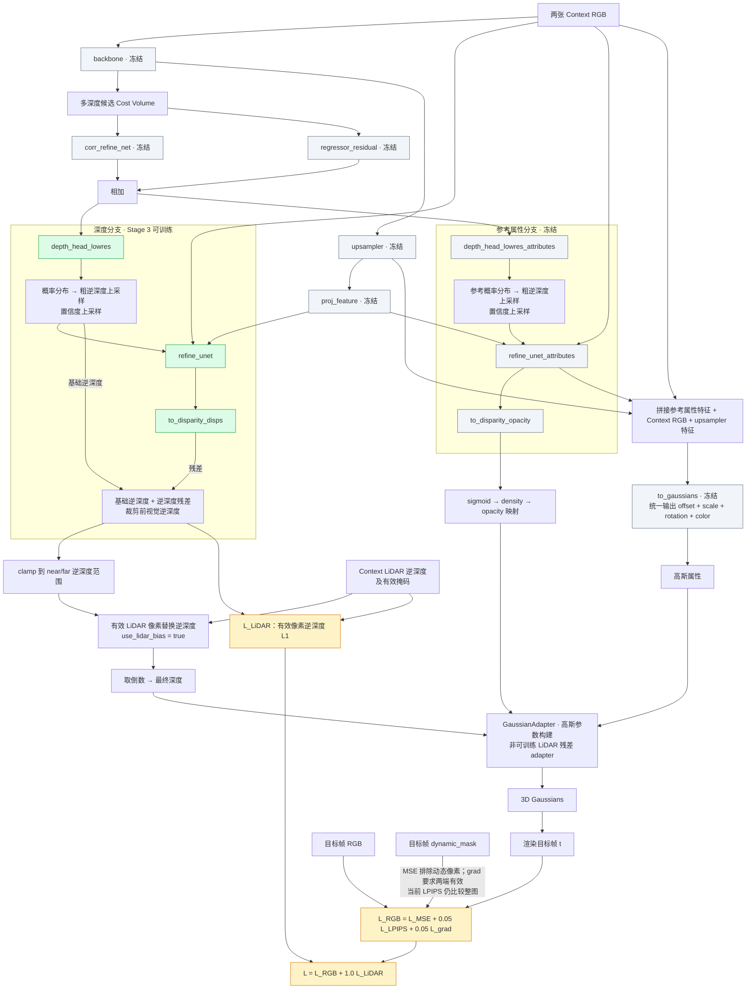
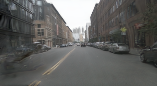
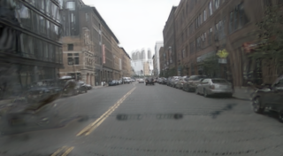

# LiDAR-Enhanced MVSplat

本项目基于 [MVSplat](https://github.com/donydchen/mvsplat) 开发，面向 nuScenes 时序多视角输入，将稀疏 LiDAR 引入 cost-volume 深度预测和 3D Gaussian 属性预测。当前实现包含 LiDAR 深度锚点、深度分支微调与 Gaussian 属性修正。

## 1. 当前进度

目前仓库包含以下实验配置（旧配置的冻结前缀迁移见下文）：

| 配置 | 作用 | 当前训练目标 |
| --- | --- | --- |
| `baseline.yaml` | 加载 RE10K checkpoint，关闭全部 LiDAR 分支 | 不训练额外模块，用于视觉模型直接推理 |
| `stage0.yaml` | 加载 RE10K checkpoint 并启用 LiDAR depth bias | LiDAR Gaussian adapter 关闭，用于推理与消融 |
| `stage2.yaml` | LiDAR Gaussian 属性修正 | 冻结基础网络，训练 Gaussian adapter |

注意：`baseline/re10k.yaml` 当前仍保留旧冻结项 `depth_predictor.to_disparity`。使用这些配置前，需要将该项替换为 `depth_predictor.to_disparity_disps` 和 `depth_predictor.to_disparity_opacity`，否则 encoder 初始化的严格前缀检查会报错。

已经完成的主要改动：

- 新增 nuScenes 时序数据接入，默认使用 `CAM_FRONT`、两个 context 帧和一个 target 帧；
- 新增运动物体 mask：将带动态属性的 nuScenes 3D annotation box 投影到图像，并扩张为保守的二维遮罩；动态区域的 LiDAR 点会在进入模型前被删除，训练损失也只在静态 target 像素上统计；
- 在视觉深度 refinement 之后注入合法 LiDAR disparity，LiDAR 点作为稀疏硬锚点，超出相机 near/far 范围的点会被丢弃；
- 新增 LiDAR Gaussian cross-attention adapter，可按配置修正 Gaussian 的 SH DC 与 opacity（当前 Stage 2 默认设置）；
- 新增Gaussian adapter 的专用训练损失、alpha 改善指标及动态诊断输出；
- Gaussian 中心深度统一由 camera z-depth 转换为沿射线距离，并使用预测的 sub-pixel offset 计算对应射线；
- 增加严格的 `frozen_params` 前缀检查，避免配置写错后意外训练基础网络。
- 将旧 `to_disparity` 拆为逆深度修正头 `to_disparity_disps` 和 density 头 `to_disparity_opacity`，各输出 `K = gaussians_per_pixel` 个通道，可分别冻结和训练；
- 新增 `ModelWrapper.load_split_checkpoint`：两个头复制旧第一层，最后一层分别取旧输出的前、后 K 个通道；新双头 checkpoint 直接加载。微调和测试入口均支持迁移，测试不再重复加载原始旧文件；
- target 动态 mask 合并 target 时刻与各 context 时刻动态物体 3D 框在 target 相机中的投影，进一步排除时序运动和遮挡区域的监督。

当前阶段仍以 `v1.0-mini`、`176 × 320` 分辨率和 2000 steps 配置进行开发验证；正式结论应在 trainval split、更长训练和统一 checkpoint 条件下复现。

## 2. 模型流程


```mermaid
flowchart TD
    A["两张 Context RGB"] --> B["backbone · 冻结"]
    B --> C["多深度候选 Cost Volume"]
    C --> D["corr_refine_net · 冻结"]
    C --> E["regressor_residual · 冻结"]
    D --> F["相加"]
    E --> F
    B --> I["upsampler · 冻结"]
    I --> J["proj_feature · 冻结"]

    subgraph DEPTH["深度分支 · Stage 3 可训练"]
        G["depth_head_lowres"]
        H["概率分布 → 粗逆深度上采样<br/>置信度上采样"]
        L["refine_unet"]
        M["to_disparity_disps"]
        V["基础逆深度 + 逆深度残差<br/>裁剪前视觉逆深度"]
        G --> H --> L --> M
        H -->|"基础逆深度"| V
        M -->|"残差"| V
    end

    subgraph ATTR["参考属性分支 · 冻结"]
        G0["depth_head_lowres_attributes"]
        H0["参考概率分布 → 粗逆深度上采样<br/>置信度上采样"]
        L0["refine_unet_attributes"]
        O0["to_disparity_opacity"]
        G0 --> H0 --> L0 --> O0
    end

    F --> G
    F --> G0
    J --> L
    J --> L0
    A --> L
    A --> L0

    L0 --> AC["拼接参考属性特征 + Context RGB + upsampler 特征"]
    A --> AC
    I --> AC
    AC --> N["to_gaussians · 冻结<br/>统一输出 offset + scale + rotation + color"]
    N --> P["高斯属性"]

    V --> CL["clamp 到 near/far 逆深度范围"]
    CL --> REPLACE["有效 LiDAR 像素替换逆深度<br/>use_lidar_bias = true"]
    LD["Context LiDAR 逆深度<br/>及有效掩码"] --> REPLACE
    REPLACE --> Z["取倒数 → 最终深度"]
    O0 --> OP["sigmoid → density → opacity 映射"]
    Z --> Q["GaussianAdapter · 高斯参数构建<br/>非可训练 LiDAR 残差 adapter"]
    OP --> Q
    P --> Q
    Q --> R["3D Gaussians"]
    R --> RENDER["渲染目标帧 t"]
    RENDER --> RGBLOSS["L_RGB = L_MSE + 0.05 L_LPIPS + 0.05 L_grad"]
    TARGET["目标帧 RGB"] --> RGBLOSS
    MASK["目标帧 dynamic_mask"] -->|"MSE 排除动态像素；grad 要求两端有效<br/>当前 LPIPS 仍比较整图"| RGBLOSS
    V --> LL["L_LiDAR：有效像素逆深度 L1"]
    LD --> LL
    RGBLOSS --> TOTAL["L = L_RGB + 1.0 L_LiDAR"]
    LL --> TOTAL

    classDef trainable fill:#dcfce7,stroke:#16a34a;
    classDef frozen fill:#f1f5f9,stroke:#64748b;
    classDef loss fill:#fef3c7,stroke:#d97706;
    class G,L,M trainable;
    class B,D,E,I,J,G0,L0,O0,N frozen;
    class LL,RGBLOSS,TOTAL loss;
```


说明：`to_gaussians` 预测几何/颜色原始参数，`to_disparity_disps` 预测 full-resolution disparity residual，`to_disparity_opacity` 预测 density 原始值，再经 sigmoid 与 opacity 映射。中心位置还依赖像素偏移和相机参数。两个头共享 refinement 特征；单独训练一个头时，需冻结共享网络才能避免另一头的输入随训练改变。Stage 2 adapter 默认只修改 LiDAR 像素处的 SH DC 和 opacity，不修改 xy、scale、rotation 或其余 SH 系数。RGB 图像本身不会被 dynamic mask 擦除，因此 backbone 和 cost volume 仍能看到完整画面；mask 只约束 LiDAR 与损失的有效区域。

## 3. 环境安装

推荐 Linux、Python 3.10 和支持 CUDA 的 NVIDIA GPU：

```bash
conda create -n lidar_mvsplat python=3.10 -y
conda activate lidar_mvsplat

pip install torch==2.1.2 torchvision==0.16.2 torchaudio==2.1.2 \
  --index-url https://download.pytorch.org/whl/cu118
pip install -r requirements.txt
pip install nuscenes-devkit
pip install ./diff-gaussian-rasterization-modified-main
```

检查 CUDA rasterizer：

```bash
python -c "import diff_gaussian_rasterization; print('Rasterizer OK')"
```

如编译失败，请检查 PyTorch CUDA、CUDA Toolkit 和 GCC/G++ 的版本兼容性，以及 `diff-gaussian-rasterization-modified-main/third_party` 是否完整。

## 4. 数据与 checkpoint

将 nuScenes 放置为：

```text
datasets/nuscenes/
├── maps/
├── samples/
├── sweeps/
├── v1.0-mini/
└── v1.0-trainval/
```

默认时序设置为：

```text
context: [t-1, t+1]
target:  [t]
camera:  CAM_FRONT
```

### 4.1 运动物体 mask

数据集根据 nuScenes annotation 的动态 attribute 筛选运动物体，将其世界坐标 3D box 投影到对应相机。投影框会按比例扩张，并保证最小像素 padding，以覆盖标注框边缘和投影误差：

```yaml
dataset:
  dynamic_mask_expansion_ratio: 0.15
  dynamic_mask_min_padding_px: 8
  dynamic_mask_min_depth: 0.01
```

其中，`target.dynamic_mask` 是 target 时刻与各 context 时刻动态物体 3D annotation 在 target 相机中的投影并集。这里重新投影的是各时刻的 3D 框，并非直接 warp context 的二维 mask。

生成的 `context.dynamic_mask` 和 `target.dynamic_mask` 用于：

- 在数据加载阶段删除 context 动态区域内的 LiDAR depth/mask；target
  dynamic mask 不再生成对应的 LiDAR 张量；
- 从 MSE 和 Gaussian adapter loss 中排除动态 target 像素；
- 在启用 context render loss 时，只监督静态 LiDAR 像素。

从 [MVSplat 官方仓库](https://github.com/donydchen/mvsplat)下载 RE10K 预训练模型并保存为：

```text
checkpoints/re10k.ckpt
```

当前配置的 `unimatch_weights_path: null` 表示从上述完整 checkpoint 加载时无需额外准备 GMDepth/UniMatch 权重；从头训练 backbone 时需要自行提供相应初始化。

## 5. 训练

### 5.1 Stage 2：Gaussian 属性修正

Stage 2 训练 Gaussian adapter。仓库配置中的 checkpoint 文件名仅是本地实验默认值，建议显式覆盖：

```bash
python -m src.main \
  +experiment=stage2 \
  mode=train \
  checkpointing.load=checkpoints/re10k.ckpt \
  checkpointing.resume=false
```

Stage 2 冻结基础网络，只训练 `depth_predictor.lidar_gaussian_adapter`。当前配置允许它修正 `SH DC + opacity`，并在非 LiDAR 像素的最终写入边界保持原始 Gaussian 参数不变。

### 5.2 Adaptation：只微调逆深度头

```bash
python -m src.main \
  +experiment=adaptation \
  mode=train \
  checkpointing.load=checkpoints/re10k.ckpt \
  checkpointing.resume=false
```

当前配置使用学习率 `1e-6`、2000 steps、MSE 监督（LPIPS 权重为 0），冻结 backbone、refinement、opacity 头和 `to_gaussians`。开启 LiDAR hard-anchor bias，LiDAR Gaussian adapter 关闭。旧单头权重会自动拆分；新双头权重再次微调时直接加载。`resume=true` 用于恢复结构与配置匹配的新双头训练 checkpoint，不用于迁移旧单头优化器状态。

## 6. 测试与评测

视觉模型 Baseline 关闭 LiDAR depth bias 和LiDAR Gaussian adapter，直接加载
`re10k.ckpt` 推理：

```bash
python -m src.main \
  +experiment=baseline \
  mode=test \
  checkpointing.load=checkpoints/re10k.ckpt \
  checkpointing.resume=false \
  dataset/view_sampler=evaluation \
  test.compute_scores=true \
  hydra.run.dir=outputs/baseline/inference
```

根据 checkpoint 所属阶段选择相同实验配置：

```bash
python -m src.main \
  +experiment=stage2 \
  mode=test \
  checkpointing.load=checkpoints/<YOUR_CHECKPOINT>.ckpt \
  dataset/view_sampler=evaluation \
  test.compute_scores=true \
  hydra.run.dir=outputs/stage2/<EXPERIMENT_NAME>
```

评测分数和渲染图像写入对应的 `outputs` 目录。测试时可用 `save_lidar_alpha_diagnostics` 控制 LiDAR alpha 诊断；运动物体 mask 的生成与过滤逻辑见 4.1 节。

### 6.1 分别渲染 Context 高斯和完整高斯

脚本 `src/scripts/render_context_gaussians.py` 默认继承 `baseline.yaml`，
加载 `checkpoints/re10k.ckpt`，沿用 baseline 的数据集、相机、分辨率和测试采样配置。
一次编码后，将各 context view 的 Gaussian 子集分别渲染到 target 相机，
同时输出全部 context Gaussian 的完整渲染和 target 真值。需要 CUDA rasterizer：

```bash
python -m src.scripts.render_context_gaussians

# 仅渲染一个测试 batch，可覆盖 checkpoint 和输出目录
python -m src.scripts.render_context_gaussians \
  checkpointing.load=checkpoints/re10k.ckpt \
  render.max_batches=1 \
  render.output_dir=outputs/context_render
```

结果保存在
`outputs/context_render/<SCENE>/batch_<BATCH>/target_<INDEX>/`，其中
`context_0.png`、`context_1.png` 是各 context Gaussian 子集的渲染，
`full.png` 是全部 context Gaussian 的联合渲染，`ground_truth.png` 是 target 图像。
完整配置保存为输出目录下的 `config.yaml`。
nuScenes 当前返回的 `INDEX` 是样本内部视角编号，context/target 帧由数据集自动选取。

## 7. W&B

可在实验 YAML 中设置 W&B 项目、实体与运行名称，或通过命令行覆盖。首次使用运行：

```bash
wandb login
```

请勿将个人 W&B API key 提交到仓库。共享配置前也应将个人 `wandb.entity` 改为团队实体或通过命令行传入。

## 8. 推荐目录结构

```text
.
├── checkpoints/
│   ├── re10k.ckpt
│   └── <YOUR_CHECKPOINT>.ckpt
├── datasets/
│   └── nuscenes/
├── diff-gaussian-rasterization-modified-main/
├── config/
├── src/
├── outputs/
├── requirements.txt
└── README.md
```

所有相对路径均以项目根目录为基准。遇到数据或 checkpoint 找不到时，可先检查：

```bash
ls datasets/nuscenes
ls checkpoints/re10k.ckpt
```

## 9. 实验记录

PSNR/SSIM 越高越好，LPIPS 越低越好。

| 实验 | LiDAR bias | Gaussian adapter | 本阶段训练模块 | PSNR ↑ | SSIM ↑ | LPIPS ↓ | 推理展示（scene-0103） |
| --- | :---: | :---: | --- | ---: | ---: | ---: | :---: |
| Baseline | — | — | 无（直接推理） | 17.4256 | **0.4068** | **0.3872** |  |
| Bias | ✓ | — | 无（直接推理） | 17.4115 | 0.3921 | 0.4138 |  |
| Stage 3 | ✓ | — | `depth_predictor.depth_head_lowres,refine_unet,to_disparity_disps` | **17.6212** | 0.3975 | 0.4141 |  |
| Stage 2-v3 | ✓ | ✓ | `depth_predictor.lidar_gaussian_adapter` | 17.5519 | 0.3900 | 0.4193 |  |


## 10. 致谢与引用

本项目基于 [MVSplat](https://github.com/donydchen/mvsplat) 开发。原项目的安装、预训练模型和基础训练方法以官方说明为准。

```bibtex
@article{chen2024mvsplat,
  title   = {MVSplat: Efficient 3D Gaussian Splatting from Sparse Multi-View Images},
  author  = {Chen, Yuedong and Xu, Haofei and Zheng, Chuanxia and Zhuang, Bohan and Pollefeys, Marc and Geiger, Andreas and Cham, Tat-Jen and Cai, Jianfei},
  journal = {arXiv preprint arXiv:2403.14627},
  year    = {2024}
}
```


v2
psnr 17.475660262169775
ssim 0.38809252114264997
lpips 0.42160927823611666
v1
17.5172
0.3905
0.4198

stage5-v2
psnr 17.670995588426464
ssim 0.39989208633249457
lpips 0.41357617757537146

## Stage6：固定几何，训练 SH 颜色

`config/experiment/stage6.yaml` 将 `to_gaussians` 切成独立的 `geometry` 和
`sh` 两个卷积分支。只训练 `depth_predictor.to_gaussians.sh`（全部 SH 系数），
其余参数冻结。加载旧的联合头权重时自动复制首层并按输出通道切分末层，
保持初始预测；Stage6 检查点推理也应使用 Stage6 配置。

同一组联合高斯既渲染到 target，也渲染回全部 context 相机。
两组图像均使用 MSE 颜色约束（权重 1.0）和图像梯度结构约束（权重 0.05），
排除动态 mask；context 监督覆盖所有静态像素，不限于 LiDAR 点。
不启用深度损失。结构约束指 RGB 相邻像素梯度匹配，并非深度平面约束。

```bash
python -m src.main +experiment=stage6 checkpointing.load=checkpoints/stage3.ckpt
```

也可将加载路径换成 `checkpoints/stage5-v2.ckpt`。默认学习率为 `1e-5`。
`loss.context_color_weight` 与 `loss.context_structure_weight` 控制新增的
context 监督，其他阶段默认均为 0，保留原训练行为。

深度损失统一由 `train.enable_depth_losses` 控制，默认关闭，仅 Stage3 默认开启。
关闭时直接跳过 `cross_visual_depth`、`cross_lidar_depth`、`lidar_depth` 的
forward 和诊断计算，不影响 MSE、结构约束和 context 重建。
此开关同时控制跨视图 LiDAR 标签生成；开启时自动补齐未配置的三项深度损失，
已有损失参数保持不变。Stage6 默认关闭。临时关闭可使用 `train.enable_depth_losses=false`。

LiDAR bias 可分别设置 `train.use_lidar_bias`（训练）和
`test.use_lidar_bias`（验证、测试、推理）。Stage6 两项默认均为
`true`，保持原行为；其他配置未指定时沿用旧的 `use_lidar_bias`。
模型通过 `train()` / `eval()` 自动选择，不受参数是否冻结影响。
