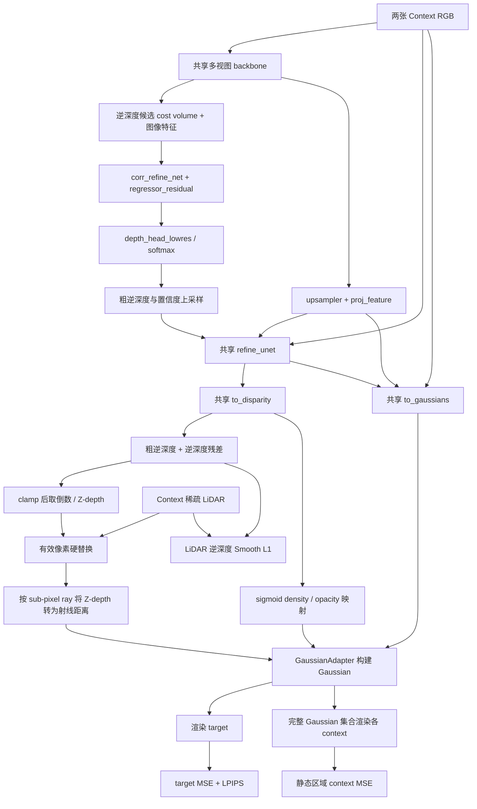

# LiDAR-Enhanced MVSplat

本项目基于 [MVSplat](https://github.com/donydchen/mvsplat)，将稀疏 LiDAR 用于 nuScenes 时序输入的深度监督与 Gaussian 中心深度锚定。当前 main 使用 **full_shared** 实现：两路 context 共享完整视觉网络和预测头，全参数微调。

本文以 main 当前代码为准。下一阶段的数据扩展与消融计划见 [HANDOFF_ABLATIONS.md](HANDOFF_ABLATIONS.md)。历史实验名称不代表当前仍有对应配置。

## 1. 当前入口与默认设置

nuScenes 的有效训练入口是 `config/experiment/stage5.yaml`。文件名沿用历史命名，**当前 stage5 是 full_shared，不是拆头交替训练模型**。仓库另保留 acid、dtu 配置；baseline、stage0、stage2、stage3、stage4 实验配置当前均不存在。

| 项目 | stage5 当前设置 |
| --- | --- |
| 数据 | nuScenes `v1.0-mini` |
| 相机 | 六路相机分别生成样本，共同训练 |
| 输入 / 目标 | 同一相机 `[t-1, t+1] → t` |
| 图像分辨率 | 176 × 320 |
| 深度范围 | camera Z-depth 1～80 m |
| 深度候选 / 每像素 Gaussian | 128 / 1 |
| 可训练参数 | `frozen_params: []`，不显式冻结 encoder 参数 |
| 初始化 | `checkpoints/re10k.ckpt`，只加载模型权重 |
| batch size | train=2，val/test=1 |
| 步数 / 初始配置学习率 | 60000 / `1e-4` |
| 优化器 / 调度器 | Adam / OneCycleLR，余弦退火 |
| checkpoint | 每2000个训练step保存，`save_top_k: -1` |
| 在线验证 / W&B | 默认关闭 / disabled |
| LiDAR 硬替换 | 训练、测试均开启 |

六路数据共同训练不等于六相机联合融合；一个样本只使用同一相机的两个时序 context。固定训练步数下，扩大数据会降低样本重复覆盖次数。

## 2. 模型与损失

### 2.1 前向流程


```mermaid
flowchart TD
    RGB[两张 Context RGB] --> BACK[共享多视图 backbone]
    BACK --> CV[逆深度候选 cost volume + 图像特征]
    CV --> CORR[corr_refine_net + regressor_residual]
    CORR --> LOW[depth_head_lowres / softmax]
    LOW --> COARSE[粗逆深度与置信度上采样]
    BACK --> UP[upsampler + proj_feature]
    RGB --> REF[共享 refine_unet]
    COARSE --> REF
    UP --> REF
    REF --> DISP[共享 to_disparity]
    DISP --> RAW[粗逆深度 + 逆深度残差]
    DISP --> DENS[sigmoid density / opacity 映射]
    REF --> ATTR[共享 to_gaussians]
    RGB --> ATTR
    UP --> ATTR
    RAW --> DEPTH[clamp 后取倒数 / Z-depth]
    LIDAR[Context 稀疏 LiDAR] --> REPLACE[有效像素硬替换]
    DEPTH --> REPLACE
    REPLACE --> GEO[按 sub-pixel ray 将 Z-depth 转为射线距离]
    GEO --> GAUSS[GaussianAdapter 构建 Gaussian]
    DENS --> GAUSS
    ATTR --> GAUSS
    GAUSS --> TARGET[渲染 target]
    GAUSS --> CONTEXT[完整 Gaussian 集合渲染各 context]
    RAW --> LD[LiDAR 逆深度 Smooth L1]
    LIDAR --> LD
    TARGET --> LT[target MSE + LPIPS]
    CONTEXT --> LC[静态区域 context MSE]
```

`to_disparity` 是单个共享的 `Conv2d → GELU → Conv2d`，输出逆深度残差与 density；没有按 context 拆成独立头。`to_gaussians` 预测 sub-pixel offset、scale、rotation 和 SH 等原始属性，两路 context 共同使用。当前没有交替训练或旧拆头 checkpoint 自动迁移逻辑。

`GaussianAdapter` 是从网络输出构建 Gaussian 参数的转换模块，不是额外的 LiDAR cross-attention 属性修正网络。两路 context 的 Gaussian 合并后用于 target 和 context 渲染。

### 2.2 LiDAR 硬替换

`dataset.load_lidar_depth=true` 时，数据集使用 nuScenes SDK 将各 context 对应的单帧 `LIDAR_TOP` 投影到相机，再映射到裁剪图像；同像素多点保留最近 Z-depth，缺失处为0，不做稠密补全。使用相机和 LiDAR 各自拍摄时刻的标定与 ego pose。

硬替换位于视觉逆深度 refinement、clamp 和取倒数之后，Gaussian 构建之前。只替换有限、正数且位于 near/far 范围内的点。替换像素不通过中心深度向视觉深度分支回传梯度，其他像素保留原梯度。

```yaml
model:
  encoder:
    use_lidar_bias_train: true
    use_lidar_bias_test: true
```

训练模式使用 train 开关；验证、测试的 eval 模式使用 test 开关。它们不影响下面的 LiDAR 逆深度监督是否启用。

### 2.3 当前总损失

stage5 的实际目标为：

```text
L = L_target_MSE + 0.05 L_target_LPIPS
  + 1.0 L_LiDAR_inverse_depth + 1.0 L_context_RGB
```

- **target MSE**：整张 target 图像的均方误差，当前没有应用动态 mask。
- **target LPIPS**：VGG LPIPS，输入 normalize，整图计算，从 step 0 起启用。
- **LiDAR inverse depth**：在有效 context LiDAR 像素上，比较截断和硬替换之前的 `粗逆深度 + 残差` 与 `1 / LiDAR Z-depth`，使用 `beta=0.01` 的 Smooth L1，按有效元素数归一化。无有效点时为0，预测保留梯度。
- **context RGB**：把两路 Gaussian 的完整合并集合分别渲染回两个 context 相机，在各自 `dynamic_mask < 0.5` 的静态区域计算 MSE；不是仅渲染该 context 自己的 Gaussian。

当前没有 gradient loss 或 `cross_visual_depth` loss。注册的 loss 包括 mse、lpips、depth、lidar_inverse_depth 和 context_rgb；stage5 不启用 depth loss。

### 2.4 动态 mask 的实际用途

数据集根据带动态 attribute 的 annotation 3D box 投影二维矩形，并扩张：

```yaml
dataset:
  dynamic_mask_expansion_ratio: 0.15
  dynamic_mask_min_padding_px: 8
  dynamic_mask_min_depth: 0.01
```

context mask 来自各自时刻；target mask 合并 target 时刻和各 context 时刻的 3D 框在 target 相机中的投影。RGB 不擦除，视觉网络看到完整图像。

**当前只有 context RGB loss 使用动态 mask。** 数据集虽然生成 target mask，但 target MSE、LPIPS、测试指标均不使用它；LiDAR 深度也没有按动态 mask 删除。因此不能把当前实现描述成“全部监督与 LiDAR 都排除了运动区域”。

## 3. 环境与数据准备

需要支持 CUDA 的 NVIDIA GPU、PyTorch 和本地 CUDA rasterizer。可参考以下历史环境安装命令；`requirements.txt` 多数依赖未锁定版本，实际复现请记录 Python、PyTorch、CUDA 和安装包版本。

```bash
conda create -n lidar_mvsplat python=3.10 -y
conda activate lidar_mvsplat
pip install torch==2.1.2 torchvision==0.16.2 torchaudio==2.1.2 --index-url https://download.pytorch.org/whl/cu118
pip install -r requirements.txt
pip install nuscenes-devkit
pip install ./diff-gaussian-rasterization-modified-main
python -c "import diff_gaussian_rasterization; print('Rasterizer OK')"
```

CUDA 扩展的编译需匹配 PyTorch、CUDA Toolkit 和编译器环境。所有命令从项目根目录运行。

```text
datasets/nuscenes/
├── maps/
├── samples/
├── sweeps/                 # 按下载包提供；当前深度使用单帧点云
├── v1.0-mini/
└── v1.0-trainval/          # 扩大数据时准备
checkpoints/
└── re10k.ckpt
```

RE10K 预训练权重从 [MVSplat 官方仓库](https://github.com/donydchen/mvsplat)获取。stage5 设置 `unimatch_weights_path: null`，通过完整 RE10K checkpoint 初始化；构造 backbone 时打印的 from scratch 不代表随后没有加载完整权重。若改为从头训练，则需要自行决定是否提供 backbone 初始化。

## 4. nuScenes 采样与划分

当前数据集只支持 `num_context_views=2`、`num_target_views=1`，`frame_stride` 为正数。在每个 scene 的 sample 链上构建 `[t-stride,t+stride] → t`，不调用通用 view_sampler 选择时序窗口。改用 `dataset/view_sampler=evaluation` 不会将 nuScenes 变成 RE10K evaluation index 协议。

| 数据版本 | train | val | mode=test |
| --- | --- | --- | --- |
| v1.0-mini | mini_train | mini_val | mini_val |
| 非 mini（当前代码分支） | 官方 train | 官方 val | 官方 test |

扩大训练数据可以覆盖 `dataset.version=v1.0-trainval`。但**目前不能直接用相同覆盖运行 mode=test 并期待评测官方 val**：代码选择的是 test 场景，trainval 元数据下可能为空；官方 test 也不满足当前依赖动态 annotation 的本地评测条件。需先增加显式评测 split 配置或修正本地 test 到有真值 val 的映射，并核对样本数。这个修复尚未实现，具体计划见交接文件。

默认 `num_workers=0`。nuScenes 实现为 IterableDataset，当前迭代器未按 worker/rank 分片；不要未经验证就增加 worker 或用多 GPU 正式报告结果，以免重复迭代样本。

只使用前视相机：

```text
dataset.camera_names=null dataset.camera_name=CAM_FRONT
```

## 5. 训练、恢复与配置检查

### 5.1 full_shared 微调

```bash
python -m src.main +experiment=stage5 mode=train \
  checkpointing.load=checkpoints/re10k.ckpt \
  checkpointing.resume=false \
  wandb.name=full_shared \
  hydra.run.dir=outputs/full_shared/train
```

默认60000步；固定40000步实验增加 `trainer.max_steps=40000`。从同一预训练权重独立启动消融，不从完整方案的训练结果继续训练。

```bash
# 只检查 Hydra 合成配置，不启动训练
python -m src.main +experiment=stage5 --cfg job
```

当前 `wandb.name` 默认是历史遗留的 baseline，不能根据此名称判断是否关闭 LiDAR。建议显式覆盖运行名称；W&B 默认 disabled，启用时自行设置 project、entity 和 mode。

### 5.2 恢复中断训练

```bash
python -m src.main +experiment=stage5 mode=train \
  checkpointing.load=/absolute/path/to/checkpoint.ckpt \
  checkpointing.resume=true \
  trainer.max_steps=60000 \
  hydra.run.dir=outputs/full_shared/resumed
```

`resume=false` 在训练入口严格加载模型权重，不恢复 optimizer；`resume=true` 通过 Lightning 恢复训练状态，要求结构与训练配置匹配。当前没有自动合并拆头权重或 split checkpoint 转换功能，其他分支 checkpoint 不能仅凭文件名加载。

`frozen_params` 是相对 encoder 的参数前缀，匹配不到会报错。例如冻结 backbone 可设置 `model.encoder.frozen_params=[backbone]`；完整方案保持空列表。

### 5.3 调度与在线验证

`cosine_lr=true` 实际构造 `OneCycleLR(total_steps=max_steps+10, pct_start=0.01, cycle_momentum=False, anneal_strategy='cos')`，并非手写 warmup+cosine；此路径不使用配置里的 `warm_up_steps=500`。设为 false 才使用对应 warm_up_steps 的 LinearLR。

因此60000步调度中的第40000步不等于40000总步数调度的最后一步。比较实验时必须同时保存 max_steps 和调度配置。

默认 `train.run_validation=false`，不执行在线验证和 sanity validation。需要时设置 `train.run_validation=true`；当前 val dataloader 使用 ValidationWrapper 的单样本封装，不能把在线验证当作完整验证集评测。训练保留 loss 和 checkpoint，正式指标通过离线评测获得。

## 6. 离线测试与纯视觉对照

### 6.1 测试已训练 full_shared（mini）

```bash
python -m src.main +experiment=stage5 mode=test \
  checkpointing.load=/absolute/path/to/full_shared.ckpt \
  wandb.name=full_shared_40k \
  test.compute_scores=true \
  test.output_path=outputs/evaluation \
  hydra.run.dir=outputs/full_shared/test
```

测试 batch size 必须为1。测试入口通过 Lightning 加载 checkpoint；`checkpointing.resume` 的训练恢复开关不用于改变测试的权重来源。

### 6.2 RE10K 纯视觉直接推理

当前不存在 baseline.yaml，用 stage5 覆盖 LiDAR 开关：

```bash
python -m src.main +experiment=stage5 mode=test \
  checkpointing.load=checkpoints/re10k.ckpt \
  model.encoder.use_lidar_bias_train=false \
  model.encoder.use_lidar_bias_test=false \
  dataset.load_lidar_depth=false \
  '~loss.lidar_inverse_depth' '~loss.context_rgb' '~loss.lpips' \
  wandb.name=re10k_visual \
  test.output_path=outputs/evaluation \
  hydra.run.dir=outputs/re10k_visual/test
```

测试不计算训练 loss；上面的 loss 覆盖也避免实例化不需要的训练项。

### 6.3 同预算纯视觉微调

```bash
python -m src.main +experiment=stage5 mode=train \
  checkpointing.load=checkpoints/re10k.ckpt checkpointing.resume=false \
  model.encoder.use_lidar_bias_train=false \
  model.encoder.use_lidar_bias_test=false \
  dataset.load_lidar_depth=false \
  '~loss.lidar_inverse_depth' '~loss.context_rgb' \
  trainer.max_steps=40000 \
  wandb.name=visual_finetune \
  hydra.run.dir=outputs/visual_finetune/train
```

该组用于区分域适配收益和 LiDAR 方法收益。与完整方案保持架构、初始化、样本、步数和调度一致。

### 6.4 输出与指标口径

测试写入 `test.output_path / wandb.name`，与 Hydra run dir 不同：

```text
outputs/evaluation/full_shared_40k/
├── <scene_camera_window>/color/<target_index>.png
├── scores_psnr_all.json
├── scores_ssim_all.json
├── scores_lpips_all.json
├── scores_all_avg.json
├── benchmark.json
└── peak_memory.json
```

PSNR/SSIM 越高越好，LPIPS 越低越好，均为整图指标。逐批分数JSON当前是数值列表，没有显式样本ID。`eval_time_skip_steps=5` 仅排除前几个 batch 的计时，不排除其图像质量分数。计时为编码器/解码器调用，不等于含数据读取和 LiDAR 投影的完整系统延迟。

测试默认保存图片；大规模评测可设 `test.save_image=false`。空数据不构成有效结果，开始前核对 split 与非零样本数。

## 7. 消融与历史工具说明

首轮建议测试：完整方案、纯视觉微调、去掉 LiDAR 逆深度监督、去掉硬替换、去掉 context loss，以及同一完整方案 checkpoint 关闭测试 LiDAR。具体矩阵和记录模板见 [交接文件](HANDOFF_ABLATIONS.md)。

仅关闭硬替换时，仍需 `dataset.load_lidar_depth=true` 以保留深度监督。只将 loss weight 设为0会保留计算路径：零权重 LiDAR loss 仍要求深度张量，零权重 context loss 仍触发 context 渲染。要测试效率，应真正从 loss 配置中移除对应项。

当前保留的历史文件有以下限制：

- `config/model/encoder/costvolume.yaml` 中的 `use_lidar_gaussian_adapter`、`lidar_gaussian_edit_*` 等旧字段不在当前 EncoderCostVolumeCfg 中，也没有对应的属性修正前向路径，不能通过开启字段启用历史 adapter。
- `test.save_lidar_alpha_diagnostics` 和 `train.enable_depth_losses` 等遗留 YAML 字段没有当前对应执行逻辑，不应据此宣称功能已启用。
- `config/render_context_gaussians.yaml` 引用已删除的 stage2；逐 context 渲染脚本还需检查新增 Gaussian 字段的切片逻辑。当前不提供其可直接运行的推荐命令，先修复并验证再使用。
- `src/scripts/measure_context_alignment.py` 使用硬编码的历史图片目录与关键点，是一次性诊断脚本。
- `wo_cost_volume_refine` 当前有实际执行分支，并非其他分支文档所说的 no-op；架构消融可能改变 checkpoint 结构，需单独验证。

## 8. 实验记录

以下为已记录的历史结果，供接力实验参考；历史 checkpoint、resolved config、seed 和评测目录需补档。当前 YAML 默认60000步，不能反推这些40000步训练使用的历史调度。

### CAM_6

| 实验 | 训练模块（历史标记） | PSNR ↑ | SSIM ↑ | LPIPS ↓ | steps |
| --- | --- | ---: | ---: | ---: | ---: |
| baseline_depth_error | 无，直接推理 | 20.0636 | 0.5540 | 0.3676 | 0 |
| baseline | 无，直接推理 | 20.1596 | 0.5534 | 0.3652 | 0 |
| full_shared | all | 20.4492 | 0.5537 | 0.3213 | 40000 |
| pruned | all-3 module | 20.1844 | 0.5440 | 0.3340 | 40000 |
| pruned_split | all-3module+to_disparity+to_gaussians | 20.3112 | 0.5555 | 0.3351 | 40000 |
| pruned_split_alternating | all-3module+to_disparity+to_gaussians | 20.2357 | 0.5463 | 0.3362 | 40000 |
| pruned_split_alternating | all-3module+to_disparity+to_gaussians | 20.2359 | 0.5473 | 0.3348 | 60000 |

四个训练变体的历史记录均标注新增 lidar_inverse_depth、context_rgb。删减的三个模块与拆头细节需查对应分支代码，当前 main 不包含这些结构。

full_shared 相比直接推理 baseline：PSNR +0.2896 dB，LPIPS -0.0439，SSIM 基本持平；不是所有指标都最优，也尚未排除普通 nuScenes 微调收益。mini 上的结论需在完整数据和统一训练预算下复现。

### 其他历史记录（条件待核对）

| 历史名称 | 历史标记的新增 loss | PSNR ↑ | SSIM ↑ | LPIPS ↓ |
| --- | --- | ---: | ---: | ---: |
| stage 5 | cross_visual_depth、lidar_inverse_depth、context_rgb | 19.5265 | 0.5118 | 0.3511 |

该记录缺少完整协议且包含当前未实现的 cross_visual_depth，保留作追溯，不与 CAM_6 直接排名，也不等同于当前 stage5 配置。

## 9. 目录与复现材料

```text
config/experiment/stage5.yaml           # full_shared 训练与测试入口
config/dataset/nuscenes.yaml            # nuScenes 基础配置
src/dataset/dataset_nuscenes.py         # 时序窗口、投影、动态 mask
src/model/encoder/encoder_costvolume.py # 共享编码器与 LiDAR 硬替换
src/model/encoder/costvolume/           # cost volume / 深度 refinement
src/model/model_wrapper.py             # 训练、评测、优化器
src/loss/                              # 损失实现
tests/                                 # 几何、硬替换、逆深度监督检查
HANDOFF_ABLATIONS.md                    # 下一阶段交接计划
```

每次实验保存 git commit、依赖版本、完整配置与 overrides、split 场景列表、样本数、seed、初始化/训练 checkpoint、原始指标和可视化。不要提交数据集、权重或 W&B API key。

## 10. 致谢与引用

本项目基于 [MVSplat](https://github.com/donydchen/mvsplat) 开发，原项目安装与预训练资源以其官方说明为准。

```bibtex
@article{chen2024mvsplat,
  title   = {MVSplat: Efficient 3D Gaussian Splatting from Sparse Multi-View Images},
  author  = {Chen, Yuedong and Xu, Haofei and Zheng, Chuanxia and Zhuang, Bohan and Pollefeys, Marc and Geiger, Andreas and Cham, Tat-Jen and Cai, Jianfei},
  journal = {arXiv preprint arXiv:2403.14627},
  year    = {2024}
}
```

## 11. 版权声明

Copyright © 2026 张雪丽. All rights reserved.

未经著作权人书面许可，不得复制、修改、发布、再许可或用于商业及学术成果申报。
